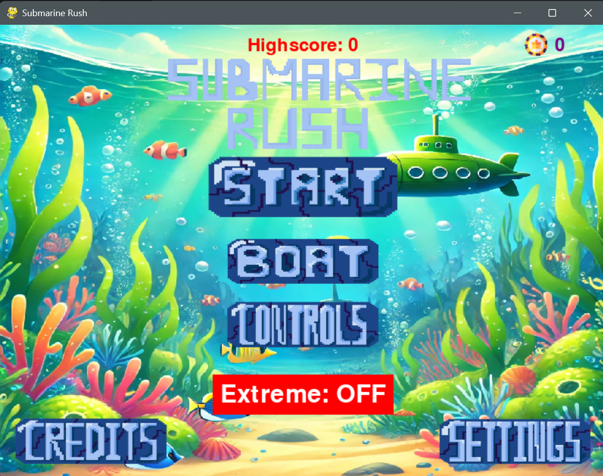
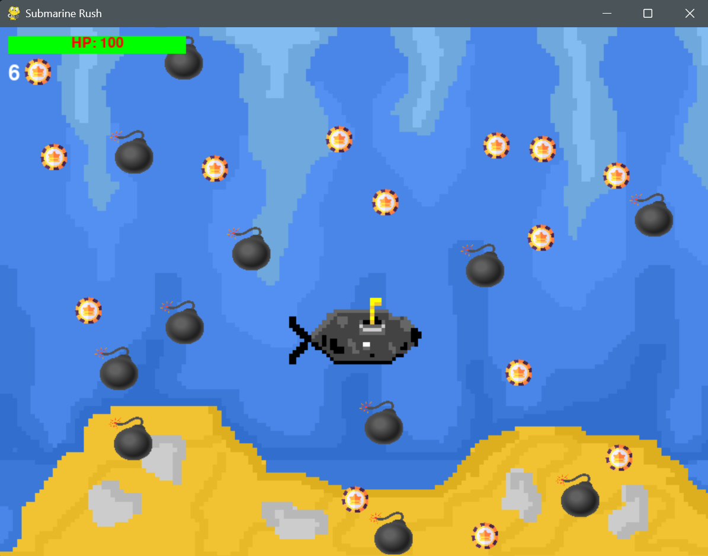
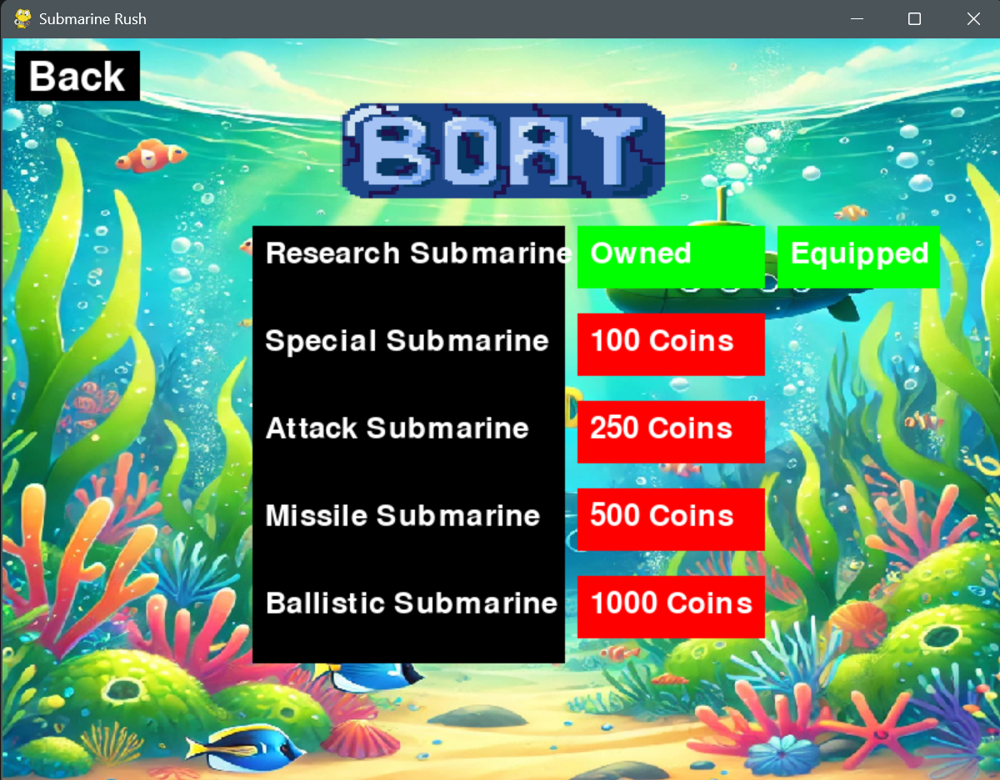

# Submarine Rush

A modular 2D submarine game built with Python and Pygame.

## Getting Started

**Prerequisites:** Python 3.10+

1. (Recommended) Create and activate a virtual environment:

   ```bash
   python -m venv venv
   source venv/bin/activate       # Windows: venv\Scripts\activate
   ```

2. Install dependencies:

   ```bash
   pip install -r requirements.txt
   ```

3. Run the game:

   ```bash
   python main.py
   ```

## Screenshots







## Features

- Modular project architecture
- Multiple playable submarines
- Boat purchasing and equipment system
- Collision system
- Coin collection
- Bomb hazards
- Audio and music system
- Main menu and pause menu
- Controls, settings and credits screens
- Multiple game states
- Resizable game window

## Technologies

- Python 3
- Pygame

## Project Structure

```text
submarine-rush/
├── assets/
│   ├── screenshots/
│   │   ├── main-menu.png
│   │   ├── gameplay.png
│   │   └── boat-selection.png
│   ├── ...
├── config/
├── data/
├── entities/
├── game/
├── systems/
├── ui/
├── main.py
├── requirements.txt
├── .gitignore
├── LICENSE
└── README.md
```
